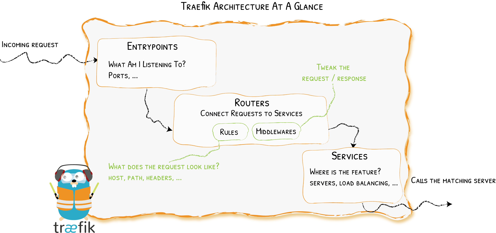

### Future Proof

https://doc.traefik.io/traefik/providers/kubernetes-ingress/

https://github.com/kubernetes/ingress-nginx

Traefik just seems a lot more flexible than NGINX although it's slower.

Traefik is batteries included meanwhile NGINX requires modules it seems like.

### Lets Encrypt and DNS

Traefik automatically allows for grabbing of certificates and is extremely helpful in that manner. In this specific setup DNS 01 is used for the challenge for lets encrypt allowing for our services to remain behind a firewall, closed from outside world but still have certificates.

What is needed for this to work is a DNS server that let's encrypt can access external from local network.

[Traefik Documentation](https://doc.traefik.io/traefik/https/acme/)
[Lets Encrypt through GO and Google domains](https://go-acme.github.io/lego/dns/googledomains/)

[Docker Security](https://docs.docker.com/engine/reference/run/)

### What Needs DNS

For the services I don't want publicly known such as proxmox, I have it accessible via DNS only through pihole. So any services that needs to access external services through their domain names (ex. dashboard dashy) they need to have their DNS set to pihole.

### TrueNAS and NextCloud

Nextcloud require for it's FQDN to be specified or else it doesn't work properly. [link](https://www.reddit.com/r/Traefik/comments/17w62b9/hostname_being_redirected_to_ip_address_instead/)

Will fix in future.